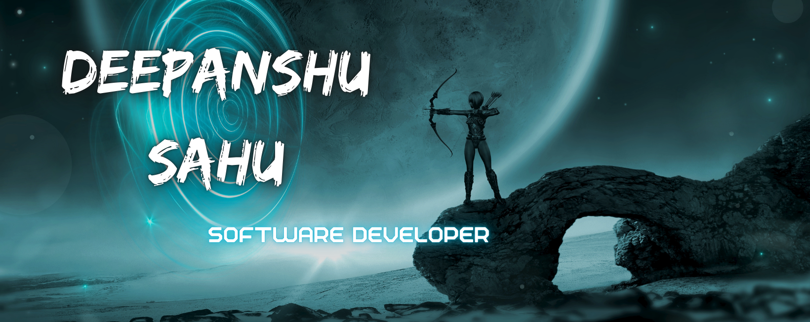

<h1 align="center">Hi 👋, I'm Deepanshu Sahu</h1>

I'm a passionate software developer with experience in backend and frontend technologies. I have a positive attitude, a love for tech, and am eager to grow and tackle new challenges. My recent projects and roles have deepened my expertise in Python, Django, React, and more 🛠️

 

💡 **I'm Currently Looking For**
I am actively seeking new opportunities to contribute to innovative projects and grow my skills. If you have a role or project that aligns with my background, feel free to reach out!

 

  
  
  
  
 

 

  
  
  
  
  

  

- 🔭 I’m currently working on [Code_Complier](https://github.com/dee077/Code_Compiler)

- 🌱 I’m currently learning **Devops, Backend**

- 📫 How to reach me **deepanshu.sahu2811@gmail.com**

- 💬 Ask me about **React, Django, Docker**

 
<h3 align="left">Connect with me:</h3>

 

<h3 align="left">Languages and Tools:</h3>

- Backend

  

- Frontend

  

- Database

  

- Cloud Servers

  

- Tools

  

 

 <em><b>I love connecting with different people</b> so if you want to say <b>hi, I'll be happy to meet you more!</b> :)</em>

 

 Created with 🧡 by <a href="http://supun.traditionalme.life">Supun Nanayakkara</a>

